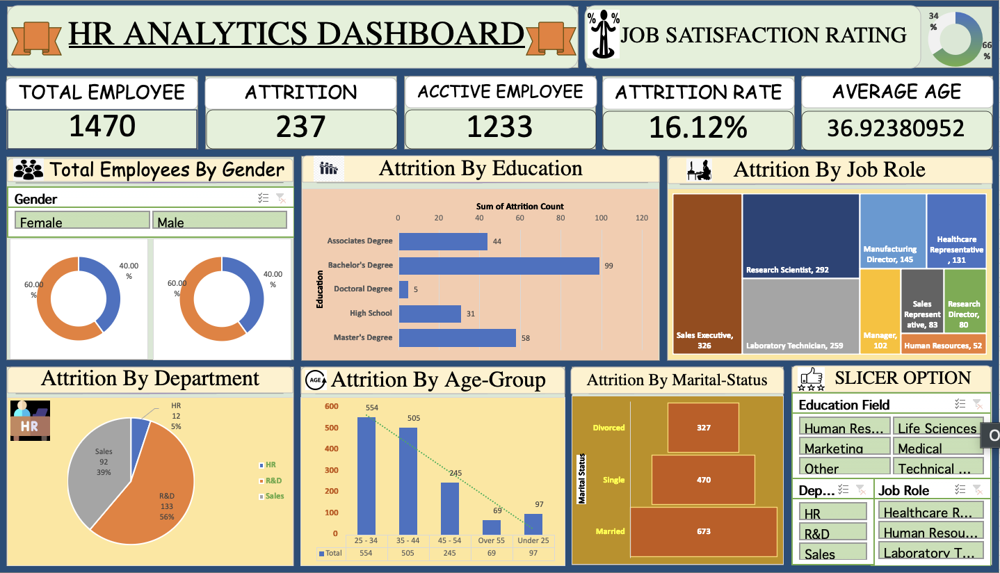

# HR-ANALYTICS-DASHBOARD
HR Analytics Dashboard built in Microsoft Excel using Pivot Tables, Charts, and Slicers. The dashboard analyzes employee attrition, job satisfaction, age distribution, gender ratio, and department insights to help HR teams make data-driven decisions.

# HR Analytics Dashboard (Excel)

## Project Overview

This project presents an **HR Analytics Dashboard built in Microsoft Excel** to analyze employee data and visualize key HR metrics. The dashboard helps organizations understand employee attrition patterns, workforce demographics, and job satisfaction levels.

The goal of this project is to demonstrate **data analysis and dashboard building skills using Excel**, commonly required in Data Analytics roles.

---

## Key KPIs in Dashboard

* Total Employees
* Active Employees
* Employee Attrition
* Attrition Rate
* Average Employee Age
* Job Satisfaction Rating

---

## Dashboard Insights

The dashboard provides visual insights such as:

* Employee distribution by **Gender**
* Attrition by **Education**
* Attrition by **Department**
* Attrition by **Job Role**
* Attrition by **Age Group**
* Attrition by **Marital Status**

Interactive **Slicers** allow users to filter the dashboard by:

* Education Field
* Department
* Job Role

---

## Tools & Features Used

* Microsoft Excel
* Pivot Tables
* Pivot Charts
* Slicers
* KPI Cards
* Data Visualization
* Excel Dashboard Design

---

## Purpose of the Project

This project was created as part of **Data Analytics practice** to showcase skills in:

* Data cleaning
* Data analysis
* Dashboard creation
* Business insight generation

---

## Screenshot

---

## Author

Mohit Bhardwaj
B.Tech – BSA College of Engineering & Technology
Aspiring Data Analyst | Python | Excel | Data Visualization
